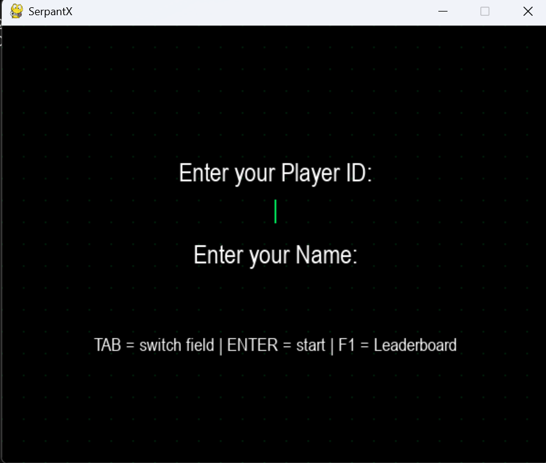

# 🐍 SerpantX

A retro, CRT-inspired take on the classic Snake game — built with **Python** and **Pygame**. SerpantX wraps the timeless snake-and-apple gameplay in a green-on-black "Matrix terminal" aesthetic, complete with scanlines, a dotted grid background, and a persistent leaderboard so you can compete with returning players.


## ✨ Features

- **Classic snake gameplay** — grid-based movement, wall/self collision detection, and grow-on-eat mechanics
- **Retro CRT visual style** — matrix-green color palette, subtle scanline overlay, and a dotted grid background
- **Player profiles** — enter a unique Player ID and name before you play
- **Persistent high scores** — your progress is saved to a local CSV file (`players.csv`) and restored automatically the next time you play under the same ID
- **In-game leaderboard** — press `F1` anytime (menu, gameplay, or game over) to view the top 10 scores across all players
- **Smooth, tunable difficulty** — movement speed is decoupled from frame rate, so controls stay responsive even at slower snake speeds
- **Graceful asset fallback** — if a sprite or sound file is missing, the game falls back to simple colored shapes instead of crashing

## 🎮 Controls

| Key | Action |
|---|---|
| `↑ / W` | Move up |
| `↓ / S` | Move down |
| `← / A` | Move left |
| `→ / D` | Move right |
| `F1` | View leaderboard |
| `Space / Enter` | Restart after Game Over |
| `Esc` | Quit |

## 🖼️ Screenshots

| Player Entry | Gameplay | Game Over | Leaderboard |
|---|---|---|---|
|  |  |  |  |

## 🛠️ Tech Stack

- **Python 3**
- **Pygame** — rendering, input, and game loop
- **CSV** (Python standard library) — lightweight local persistence for player scores, no database required

## 🚀 Getting Started

### Prerequisites
```bash
pip install pygame
```

### Run the game
```bash
python SerpantX.py
```

### Assets
Place your sprite/sound files in the folder pointed to by `ASSET_PATH` in `SerpantX.py` (update this path to match your local setup). The game will still run without them, using simple colored rectangles as a fallback.

## 📁 How Scores Are Saved

Each player is identified by a unique **Player ID**. On restart, entering the same ID pulls back that player's saved name and high score from `players.csv`. New high scores are saved immediately during play, and again on quit, so progress is never lost.

## 🙏 Acknowledgements

Thanks to Hemant for guidance and support throughout the project.

